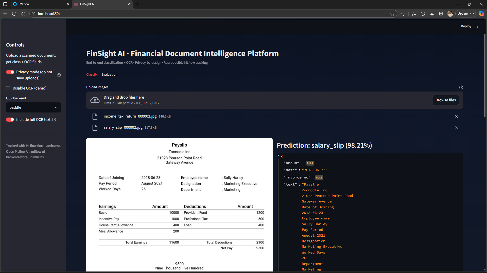

<div align="center">

# FinSight AI – Financial Document Classification & OCR

Robust multi-class financial document image classification with privacy-aware OCR extraction.



<!-- Badges -->
<p>
	<a href="https://www.python.org/"></a>
	<a href="#docker"></a>
	<a href="#performance"></a>
	<a href="#ai"></a>
	<a href="https://mlflow.org"></a>
	<a href="#api"></a>
	<a href="#release"></a>
	<a href="#architecture"></a>
	<a href="#streamlit-ui"></a>
</p>

</div>

## About
FinSight AI unifies document image classification, targeted OCR field extraction, privacy controls, and experiment tracking into a single deployable solution. The repository is structured for public portfolio visibility (clean commit history, clear licensing, contribution docs) and supports future extension to REST / gRPC APIs or container orchestration. A pre-built Docker configuration (see below) enables reproducible deployment. Test-Time Augmentation (TTA) and multiple OCR engines deliver strong baseline accuracy without model retraining.

## Overview
FinSight AI classifies scanned financial documents (bank statements, salary slips, income tax returns, utility bills, cheques, etc.) and extracts key fields (amounts, dates, invoice numbers) using pluggable OCR backends. It emphasizes:
* Reproducibility (MLflow tracking with run metadata, label maps, confusion matrices)
* Privacy (in‑memory OCR mode, optional exclusion of full raw text)
* Extensibility (pluggable OCR backends: EasyOCR, Tesseract, PaddleOCR; test-time augmentation for inference)

## Feature Highlights
* PyTorch + timm backbone (EfficientNet-B0 by default for CPU efficiency)
* Auto class discovery (`--classes auto`)
* Test-Time Augmentation (TTA) for improved inference robustness without retraining
* Multiple OCR engines: EasyOCR (default), Tesseract, PaddleOCR (for better printed + some handwriting support)
* Key-field only OCR option (omit full text for extra privacy)
* MLflow experiment logging: params, metrics (train/val/test), confusion matrices, training curves, run metadata (git commit, class list)
* Streamlit professional UI (dark theme) with evaluation dashboard & ledger of extracted fields
* PaddleOCR + improved preprocessing pipeline (binarization, denoising) for higher accuracy

## Current Classes
`bank_statement, salary_slip, income_tax_return, utility_bill, cheque` (others can be added when real data available)

## Quick Start

```powershell
python -m venv .venv; .\.venv\Scripts\Activate.ps1
pip install -U pip
pip install -r requirements.txt

# (Optional) Ingest real Kaggle data (adjust limits as needed)
python -m src.ingest_kagglehub --limit_per_class 1000 --min_images 20

# Train (auto-detect classes)
python -m src.train --epochs 15 --batch_size 32 --img_size 224 --classes auto

# Launch MLflow UI in another terminal
mlflow ui --backend-store-uri mlruns

# Run the app
streamlit run app/streamlit_app.py
```

## Inference & TTA
Single image prediction with optional test-time augmentation variants (rotations + brightness):
```powershell
python -m src.infer --image path\to\doc.jpg --tta 6
```
Higher TTA gives marginal accuracy gains but is slower. Recommended: 4–8.

## OCR Backends
Choose in the sidebar:
| Backend | Strengths | Notes |
|---------|-----------|-------|
| easyocr | Fast setup, multilingual | Default fallback |
| tesseract | Open-source, widely packaged | Weaker on handwriting; install separately |
| paddle | Better accuracy + angle classification | Adds dependencies |

Key-field only mode: disable "Include full OCR text" to store only extracted fields (`amount`, `date`, `invoice_no`).

## Privacy Design
* In privacy mode, uploaded files are processed in memory (no disk writes) when using in‑memory OCR path.
* Optional exclusion of full OCR text reduces PII risk.
* No external API calls—everything local.
* Ledger writes only occur if user explicitly clicks "Add to ledger".

## MLflow Artifacts
Logged per run (under `mlruns/`):
* `models/best.pt` – Best checkpoint
* `plots/confusion_matrix_val.png`, `plots/confusion_matrix_test.png`
* `plots/training_curves.png`
* `metadata/label_map.json`, `metadata/run_info.json`
* `outputs/metrics.json`, `outputs/test_predictions.csv`

## Architecture
```
 ┌────────────────┐    ┌──────────────┐    ┌─────────────┐
 │ Data Ingestion │ -> │ Dataset/Data │ -> │ Model (timm)│
 │     (Kaggle)   │    │  Loaders     │    │  + Head     │
 └────────────────┘    └──────────────┘    └─────┬───────┘
												 │
							  ┌──────────────────┴─────────────────┐
							  │ Training Loop (freeze/unfreeze,    │
							  │ metrics, MLflow logging)           │
							  └──────────────┬─────────────────────┘
											 │ best.pt
								   ┌─────────▼────────┐
								   │  Inference (TTA) │
								   └─────────┬────────┘
											 │
								   ┌─────────▼──────────┐
								   │   Streamlit UI     │
								   │ (OCR,Ledger,Eval)│ │
								   └────────────────────┘
```

## Model Card (Summary)
**Intended Use:** Assist internal finance tooling by auto-tagging scanned financial documents and extracting basic key fields. Not a replacement for human review.

**Data Sources:** Real Kaggle financial document datasets (bank statements, slips, returns, utility bills, cheques) filtered by minimum image counts. Corporate statement classes currently lack sufficient real images.

**Limitations:**
* Limited handwriting robustness (improved slightly with PaddleOCR; complex cursive not guaranteed).
* Potential bias toward formatting styles present in training datasets.
* Simple random split—documents from same multi-page set could leak between splits if pages share near-identical layout (mitigation future work: doc-level grouping).

**Ethical / Privacy Considerations:**
* OCR could expose PII if full text stored; default UI encourages privacy mode.
* Users should avoid uploading sensitive documents to public demos.

**Future Improvements:** Layout-aware parsing, doc-level splitting, active learning loop, quantized deployment build.

## Contributing
See [CONTRIBUTING.md](CONTRIBUTING.md). Please also review the [Code of Conduct](CODE_OF_CONDUCT.md).

## Roadmap
- [ ] Advanced augmentation (mixup/cutmix)
- [ ] Layout-aware model (LayoutLMv3 or Donut)
- [ ] Automatic deskew & perspective correction
- [ ] Temperature scaling calibration script
- [ ] Multi-resolution ensemble option

## Screenshots (Add your own captures)
Place images under `docs/screenshots/`:
* `ui_classify.png` – Classification tab with prediction
* `ui_eval.png` – Evaluation tab showing curves and confusion matrices
* `mlflow_runs.png` – MLflow UI run list

## License
MIT License (see [LICENSE](LICENSE)).

## Author
**Manula Fernando** – FinSight AI Project Maintainer

## Acknowledgments
* timm for backbones
* Albumentations for augmentation
* EasyOCR / PaddleOCR / Tesseract for OCR
* MLflow for experiment tracking

---
> Star the repo if you find it useful. Contributions welcome!

## Quick start

1) Create a virtual environment and install deps

```powershell
python -m venv .venv; .\\.venv\\Scripts\\Activate.ps1; pip install -U pip; pip install -r requirements.txt
```

2) Ingest real images from Kaggle datasets into `data/raw`:

```powershell
python -m src.ingest_kagglehub --limit_per_class 1000 --min_images 20
```

3) Train the classifier (logs metrics, curves, and artifacts to MLflow in `mlruns/`):

```powershell
python -m src.train --epochs 10 --batch_size 32 --lr 3e-4 --img_size 224 --classes auto
```

4) Run inference on a single image:

```powershell
python -m src.infer --image path/to/image.jpg
```

5) Launch the Streamlit app:

```powershell
streamlit run app/streamlit_app.py
```

## Extending / adjusting classes

- Place images under `data/raw/<class_name>/...` for any new class and re-run training with `--classes auto`.
- To exclude noisy classes, remove their folders or lower `--min_images` threshold in ingestion.

## Project layout

```
finance-doc-classifier/
├─ data/
│  ├─ raw/
│  ├─ processed/
│  └─ ocr_samples/
├─ src/
│  ├─ config.py
│  ├─ data_download.py
│  ├─ datasets.py
│  ├─ model.py
│  ├─ train.py
│  ├─ infer.py
│  ├─ ocr.py
│  └─ utils.py
├─ app/
│  └─ streamlit_app.py
├─ models/
├─ mlruns/
├─ requirements.txt
└─ README.md
```

## Windows notes

- EasyOCR uses PyTorch which is already required. For Tesseract (optional), install from https://github.com/UB-Mannheim/tesseract/wiki and ensure `tesseract.exe` is on PATH.

## License

MIT

## API (FastAPI Minimal Endpoint)

Run the REST API (serves /health and /classify):

```powershell
uvicorn api.main:app --reload --port 8000
```

Classify via curl (PowerShell uses backticks for line continuation, optional):

```powershell
curl -X POST "http://127.0.0.1:8000/classify?include_full_text=true" `
	-H "accept: application/json" -H "Content-Type: multipart/form-data" `
	-F "files=@path\\to\\doc1.jpg" -F "files=@path\\to\\doc2.png"
```

Response:
```json
[
	{
		"filename": "doc1.jpg",
		"prediction": "bank_statement",
		"confidence": 0.91,
		"probabilities": {"bank_statement": 0.91, "utility_bill": 0.04, "cheque": 0.03, ...},
		"ocr": {"amount": "Rs 12,345.00", "date": "2024-11-30", "invoice_no": null, "text": "..."}
	}
]
```

## Docker

Build and run a container exposing Streamlit (8501) + API (8000):

```powershell
docker build -t finsight-ai .
docker run -p 8501:8501 -p 8000:8000 --rm finsight-ai
```

Then open:
* UI: http://localhost:8501
* API health: http://localhost:8000/health

Lightweight production deploy tip: run only the API by overriding CMD:
```powershell
docker run -p 8000:8000 --rm --entrypoint uvicorn finsight-ai api.main:app --host 0.0.0.0 --port 8000
```

## Continuous Integration

GitHub Actions workflow (`.github/workflows/ci.yml`) performs:
* Dependency install + minimal lint (byte-compilation)
* OCR import smoke test
* Ephemeral API health check

Extend with tests (e.g., pytest) by adding a test stage.
